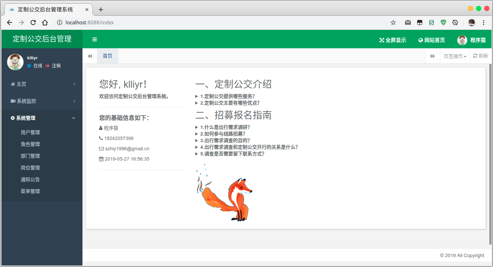
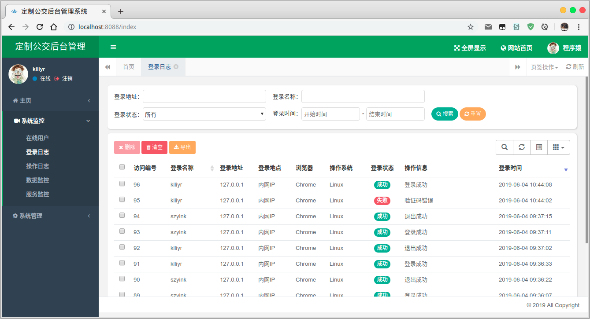
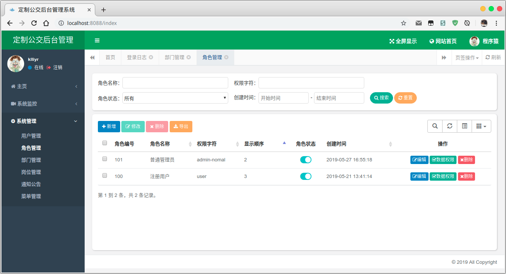

# 定制公交系统的设计与实现

> 本系统为在 numberone 上的二次开发成果，主用于毕业设计。

- 论文题目：基于 Java 的定制公交系统的设计与实现
- 内容概要：根据用户的需求定制公交线路，在充分满足用户需求的前提下，定制合理的行车路线，此系统适合人口密度较大的住宅区域。

# 一、项目结构

```bash
➜  numberone-springboot git:(master) ✗ tree -L 1
.
├── logs                    # 日志存储目录
├── numberone-admin         # 后台：前端静态文件、后端控制层、主配置文件
├── numberone-common        # 工具：自定义注解、全局配置、XSS 过滤、JSON 数据处理等
├── numberone-framework     # 框架：注解实现、数据权限、异步处理、前端控制等
├── numberone-suncustom     # 公交：定制公交模块，子模块，新增模块
├── numberone-system        # 系统：实体类、数据层、业务层等
├── profile                 # 本地图片、头像存储目录
└── sql                     # SQL 数据库导出目录

```

numberone 是一个多模块的项目，是一个 Java EE 的后台管理模块，包含了很多功能，在写自己的项目时，添加新的模块有利于分清结构，下面附录一下原介绍内容：

> NumberOne SpringBoot 是一个 Java EE 企业级快速开发平台，基于经典技术组合（Spring Boot、Apache Shiro、MyBatis、Thymeleaf、Bootstrap、Hplus），内置模块如：部门管理、角色用户、菜单及按钮授权、数据权限、系统参数、日志管理、通知公告等。在线定时任务配置；支持集群，支持多数据源。

## 主要特性

- 完全响应式布局（支持电脑、平板、手机等所有主流设备）
- 强大的一键生成功能（包括控制器、模型、视图、菜单等）
- 支持多数据源，简单配置即可实现切换。
- 支持按钮及数据权限，可自定义部门数据权限。
- 对常用 js 插件进行二次封装，使 js 代码变得简洁，更加易维护
- 完善的 XSS 防范及脚本过滤，彻底杜绝 XSS 攻击
- Maven 多项目依赖，模块及插件分项目，尽量松耦合，方便模块升级、增减模块。
- 国际化支持，服务端及客户端支持
- 完善的日志记录体系简单注解即可实现
- 缓存 EhCache 统一管理，支持快速切换为 Redis 缓存，集群 Session 缓存共享

## 技术结构

- **系统环境**

JDK 环境：Java EE 1.8

依赖管理：Apache Maven 3.6.1

- **主框架**

Spring 框架：SpringBoot 2.2 M2

安全权限框架：Apache Shiro 1.4

- **持久层**

数据库框架：Apache MyBatis 3.4、Spring Date JPA 2.1.8

后端验证框架（ORM）：Hibernate Validation 6.0

数据库监控（连接池）：Alibaba Druid 1.1

- **视图层**

前端开发工具包：Bootstrap 3.3、Layui 2.4.5

Spring 前端框架：Thymeleaf 3.0

后台主体框架：Hplus 4.1

- **开发环境**

开发操作系统：Ubuntu 18.04.02 LTS

开发编译器：IntelliJ IDEA 2019.2

# 二、搭建部署

主体上基于 SpringBoot ，所以在搭建上非常简单，主要为修改配置文件即可了。

- 配置文件：`numberone-springboot/numberone-admin/src/main/resources/application.yml`

- 数据库配置：`numberone-springboot/numberone-admin/src/main/resources/application-druid.yml`

### 配置文件

在最初设计时，是希望使用 JPA 操控数据库的，因为实在是不想写配置文件，所以在新建模块时也是如此操作的，每一个子模块本身可以有独立的配置文件，在 SpringBoot 学习时，知道各个位置出不同的配置文件最后其整合作用，相同覆盖，不同整合。

- JPA 配置

```properties
spring.datasource.url=jdbc:mysql://127.0.0.1:3306/numone-springboot?useSSL=false
spring.datasource.username=root
spring.datasource.password=szyink
spring.jpa.properties.hibernate.hbm2ddl.auto=update
spring.jpa.properties.hibernate.dialect=org.hibernate.dialect.MySQL5InnoDBDialect
spring.jpa.show-sql=true
```

### 目录结构推荐

- **实体类**
  - A: `com.xxx.domain`（jpa项目）
  - B: `com.xxx.pojo`（mybatis项目）
- **数据访问层**
  - A: `com.xxx.repository`（jpa项目）
  - B: `com.xxx.mapper`（mybatis项目）
- **服务层**
  - 接口：`com.xxx.service`
  - 实现：`com.xxx.service.impl`
- **控制层**
  - `com.xxx.controller`
- **页面文件**
  - 静态文件：`/src/main/resources/static`
  - 视图模板：`/src/main/resources/templates`
- **Mybatis 映射文件**
  - `/src/main/resources/mapper`

# 三、运行截图








